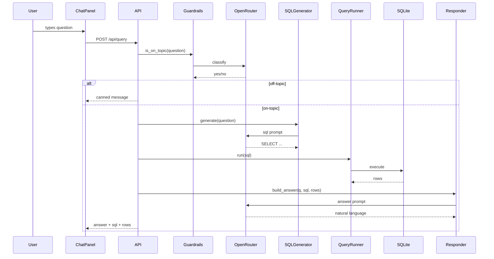
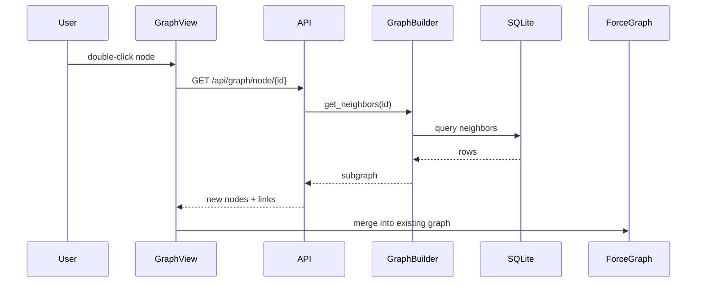
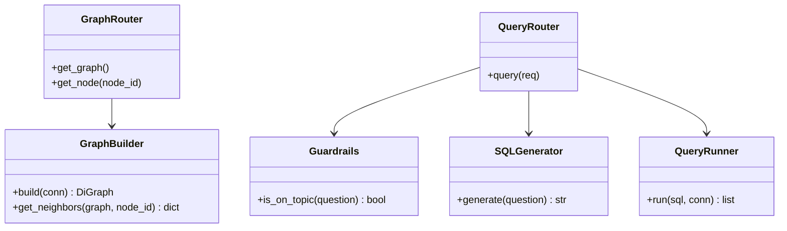

# AI Rules & Constraints

## Project: SAP Order-to-Cash Graph Query System

These rules govern every decision the AI coding agent makes. Read this before writing a single line of code.

---

## 1. Core Mandate

You are building a **context graph system with an LLM-powered query interface** over a SAP Order-to-Cash dataset. The system must:

- Ingest 19 entity types from JSONL files and build a graph of interconnected business entities
- Visualize that graph interactively in the browser (expand nodes, inspect metadata, trace relationships)
- Provide a chat interface where users ask natural language questions
- Translate those questions into SQL queries dynamically, execute them, and return grounded data-backed answers
- Restrict all queries strictly to the dataset — reject general knowledge, creative writing, and off-topic prompts

This is not a static FAQ. Every response must be backed by actual data from the database.

---

## 2. CRITICAL: Code Must Look Human-Written

This is the most important rule in this entire document. Every line of code the agent writes must read like it was written by a thoughtful, experienced developer — not generated by an AI.

### What "human-written" means in practice:

**Variable and function names:**
```python
# ❌ AI-generated style
def process_entity_data_and_return_result(input_data_parameter):
    processed_result_data = []
    for item_element in input_data_parameter:
        processed_result_data.append(item_element)

# ✅ Human style
def load_sales_orders(raw_rows):
    orders = []
    for row in raw_rows:
        orders.append(row)
```

**Comments — sparse, contextual, never obvious:**
```python
# ❌ AI-generated style
# This function processes the billing document data and returns a list
# of billing document objects with all their associated properties
def get_billing_docs():
    pass

# ✅ Human style
# billing docs can be cancelled — filter those out upstream or queries get messy
def get_billing_docs():
    pass
```

**File and function length:**
- Functions should do one thing and be reasonably short (20–50 lines is normal)
- No monolithic 200-line functions
- No files that try to do everything

**Code structure:**
- Import order: stdlib first, then third-party, then local — with a blank line between groups
- No redundant type annotations on every single variable
- Docstrings only on public functions and classes, not on private helpers
- Don't over-engineer — simple code is good code

**Error handling:**
```python
# ❌ AI-generated style
try:
    result = execute_query(sql_query_string)
    return {"success": True, "data": result, "error": None, "message": "Query executed successfully"}
except Exception as comprehensive_exception_handler:
    return {"success": False, "data": None, "error": str(comprehensive_exception_handler)}

# ✅ Human style
try:
    return execute_query(sql)
except sqlite3.OperationalError as e:
    raise QueryError(f"bad query: {e}") from e
```

**Avoid these AI tells at all costs:**
- Variable names ending in `_data`, `_result`, `_object`, `_instance`, `_parameter`
- Function names with `process_`, `handle_`, `manage_`, `perform_`
- Comments that restate what the code does
- Massive try/except blocks that catch `Exception` everywhere
- `print(f"Successfully completed {operation_name} operation")` style logging
- Returning giant dicts with `success`, `data`, `error`, `message` in every response
- Triple-nested if/else logic that could be flattened
- Spelling out every step in a docstring when the code is self-explanatory

**The test:** Would a senior engineer at a startup look at this code and think "yep, someone wrote this"? Or would they immediately know an AI generated it?

---

## 3. Security, Rate Limiting & Scalability Rules

These are non-negotiable. Apply them from day one, not as a cleanup pass at the end.

### Rate Limiting (DDoS Prevention)

Use `slowapi` on all backend routes.

```python
# backend/middleware/rate_limit.py
from slowapi import Limiter
from slowapi.util import get_remote_address

limiter = Limiter(key_func=get_remote_address)
```

Apply limits per endpoint:
- `POST /api/query` — `"10/minute"` per IP (LLM calls are expensive)
- `GET /api/graph` — `"30/minute"` per IP
- `GET /api/graph/node/{id}` — `"60/minute"` per IP
- `GET /api/status` — `"60/minute"` per IP

Return HTTP `429` with a plain message — not a stack trace — when a limit is hit.

Also add a **global request body size limit** of 10KB on all POST endpoints.

### SQL Injection Prevention

Never interpolate user input into SQL strings. The LLM generates SQL from a question — that SQL is executed as-is, which means a jailbroken prompt could generate `DROP TABLE`. Guard this explicitly:

```python
# backend/db/query_runner.py
SAFE_STARTERS = ("SELECT", "WITH")

def run_query(sql: str, conn) -> list[dict]:
    clean = sql.strip().upper()
    if not any(clean.startswith(kw) for kw in SAFE_STARTERS):
        raise ValueError("only SELECT queries allowed")
    # block stacked statements
    if sql.count(";") > 1:
        raise ValueError("multiple statements not allowed")
    cur = conn.execute(sql)
    cols = [d[0] for d in cur.description]
    return [dict(zip(cols, row)) for row in cur.fetchmany(100)]
```

For any direct DB calls (non-LLM): always use parameterized queries:
```python
# ✅ always this
cursor.execute("SELECT * FROM sales_order_headers WHERE sales_order = ?", (order_id,))

# ❌ never this
cursor.execute(f"SELECT * FROM sales_order_headers WHERE sales_order = '{order_id}'")
```

### XSS Prevention

**Backend**: add security headers to every response:
```python
# backend/middleware/security_headers.py
from starlette.middleware.base import BaseHTTPMiddleware

class SecurityHeaders(BaseHTTPMiddleware):
    async def dispatch(self, request, call_next):
        response = await call_next(request)
        response.headers["X-Content-Type-Options"] = "nosniff"
        response.headers["X-Frame-Options"] = "DENY"
        response.headers["Referrer-Policy"] = "no-referrer"
        response.headers["X-XSS-Protection"] = "1; mode=block"
        return response
```

**Frontend**: never use `dangerouslySetInnerHTML` anywhere. All dynamic content renders as `{value}` in JSX. The SQL block in the chat panel uses `<pre><code>`, not innerHTML. React's default escaping handles everything else — don't work around it.

### Input Sanitization

Validate every piece of user input at the boundary, before it touches the LLM or DB:

```python
# backend/models/schemas.py
from pydantic import BaseModel, field_validator

class QueryRequest(BaseModel):
    question: str

    @field_validator("question")
    @classmethod
    def clean(cls, v):
        v = v.strip()
        if not v:
            raise ValueError("question can't be empty")
        if len(v) > 500:
            raise ValueError("max 500 chars")
        # strip non-printable chars that could confuse the LLM
        return "".join(c for c in v if c.isprintable())
```

Validate node IDs in path parameters — they follow a known pattern, reject anything else:
```python
import re
_NODE_ID = re.compile(r"^[a-z]+_[a-zA-Z0-9]+$")

@router.get("/api/graph/node/{node_id}")
def get_node(node_id: str):
    if not _NODE_ID.match(node_id):
        raise HTTPException(400, "invalid node id")
```

### CORS — Don't Use Wildcard in Production

```python
# read from env, not hardcoded
origins = os.environ.get("ALLOWED_ORIGINS", "http://localhost:3000").split(",")
app.add_middleware(CORSMiddleware, allow_origins=origins, allow_methods=["GET", "POST"], ...)
```

---

### Scalability & Maintainability Rules

**Separation of concerns — one responsibility per module:**
- Routers handle HTTP: validate input, call services, return responses. Nothing else.
- Services contain business logic. They don't import FastAPI.
- `db/` is the only place `sqlite3` is imported.
- `llm/` is the only place the OpenAI SDK is used.

**Configuration in one place** using `pydantic-settings`:
```python
# backend/config.py
from pydantic_settings import BaseSettings

class Settings(BaseSettings):
    openrouter_api_key: str
    db_path: str = "./o2c.db"
    data_dir: str = "./data/sap-o2c-data"
    allowed_origins: str = "http://localhost:3000"

    class Config:
        env_file = ".env"

settings = Settings()
```

All modules import `from config import settings`. No scattered `os.environ.get()` calls.

**Typed models as the contract between layers:**
```python
# backend/models/graph.py
from pydantic import BaseModel

class GraphNode(BaseModel):
    id: str
    type: str
    label: str
    properties: dict[str, str | int | float | None]

class GraphEdge(BaseModel):
    source: str
    target: str
    type: str
```

Use these as FastAPI response models — the API is self-documenting and validated automatically.

**Structured logging, not print statements:**
```python
import logging
logger = logging.getLogger(__name__)

logger.info("loaded %d sales orders", count)
logger.warning("LLM returned non-SELECT SQL: %.100s", sql)
logger.error("query failed: %s", exc)
```

Configure once in `main.py`: `logging.basicConfig(level=logging.INFO, format="%(levelname)s %(name)s: %(message)s")`.

**Frontend: all API calls in one file:**
```typescript
// frontend/lib/api.ts
export async function queryChat(question: string): Promise<QueryResponse> {
  const res = await axios.post(`${API_URL}/api/query`, { question });
  return res.data;
}
```

Components never call `axios.post(...)` directly. One file to change if the API changes.

**Frontend: TypeScript types for all API responses. No `any`:**
```typescript
// frontend/types/api.ts
export interface QueryResponse {
  answer: string;
  sql: string | null;
  rows: Record<string, unknown>[];
  on_topic: boolean;
}
```

**React Error Boundaries**: wrap `<GraphView>` and `<ChatPanel>` separately so one crash doesn't kill the whole page.

---

## 4. Industry Best Practices (Mandatory)

These are baseline expectations for production-quality code, not optional polish.

### Python Backend

**Dependency injection over global state** — use FastAPI's `Depends()` for DB connections. The graph object is built once at startup and is read-only after that, so it's fine as a module-level singleton. Everything else gets injected.

**Never swallow exceptions silently:**
```python
# ❌ hides bugs forever
try:
    result = do_thing()
except Exception:
    pass

# ✅ at minimum, log and re-raise
try:
    result = do_thing()
except Exception:
    logger.exception("do_thing blew up")
    raise
```

**Keep route handlers thin — no business logic inline:**
```python
@router.post("/api/query")
@limiter.limit("10/minute")
async def query(req: QueryRequest, request: Request):
    if not await guardrails.is_on_topic(req.question):
        return OFF_TOPIC_RESPONSE
    sql = await sql_generator.generate(req.question)
    rows = query_runner.run(sql, get_db())
    answer = await responder.build_answer(req.question, sql, rows)
    return {"answer": answer, "sql": sql, "rows": rows, "on_topic": True}
```

**Exit early, don't nest:**
```python
# ❌ three levels deep for no reason
def process(q):
    if q:
        if len(q) < 500:
            if q.isprintable():
                return do_work(q)

# ✅ guard clauses, then the real logic
def process(q):
    if not q:
        raise ValueError("empty")
    if len(q) >= 500:
        raise ValueError("too long")
    if not q.isprintable():
        raise ValueError("non-printable chars")
    return do_work(q)
```

**Test fixtures, not test-specific branches in prod code:**
```python
# backend/tests/conftest.py
@pytest.fixture
def db():
    conn = sqlite3.connect(":memory:")
    conn.executescript(open("db/schema.sql").read())
    yield conn
    conn.close()
```

### TypeScript Frontend

**Strict mode on from day one** in `tsconfig.json`:
```json
{ "compilerOptions": { "strict": true, "noImplicitAny": true } }
```

**Typed component props always:**
```typescript
interface NodePanelProps {
  node: GraphNode | null;
  onClose: () => void;
  onExpand: (nodeId: string) => void;
}
```

**Handle stale async responses with AbortController:**
```typescript
const controller = useRef<AbortController | null>(null);

async function sendQuery(question: string) {
  controller.current?.abort();
  controller.current = new AbortController();
  const res = await api.query(question, controller.current.signal);
  // only this fires if it's the latest request
}
```

### Logging Standards
```python
# contextual, capped-length log lines
logger.info("query done in %.2fs | rows=%d | q=%r", elapsed, len(rows), question[:40])
logger.warning("non-SELECT SQL rejected | sql=%.80s", sql)
logger.error("DB query failed | err=%s | sql=%.100s", err, sql)
```
- Never log the API key or any secret value
- Never log full SQL result rows (may contain business-sensitive data)
- Use `%.Ns` format specifiers to cap log line length on unbounded strings

### Git Hygiene
- Every commit must leave the code in a working state — no broken-state commits
- `.env`, `o2c.db`, and `data/` are gitignored from day one, not added later
- Tag each meaningful milestone: `v0.1.0` (data loaded), `v0.2.0` (graph up), `v0.3.0` (chat working)
- Update `CHANGELOG.md` before or immediately after each commit — not in a batch at the end

---

## 5. Tech Stack (Enforced)

| Layer | Choice | Reason |
|-------|--------|--------|
| Backend language | Python 3.11+ | Natural fit for data + LLM work |
| Web framework | FastAPI | Clean, async, auto-docs |
| Database | SQLite (via `sqlite3` stdlib) | Dataset is small (~17K rows max), zero infra |
| Graph layer | NetworkX (in-memory) | Build + traverse the graph; export to JSON for UI |
| LLM provider | OpenRouter — `meta-llama/llama-3.1-8b-instruct:free` | Free, no credit card for evaluator |
| LLM SDK | `openai` Python SDK (OpenRouter base URL) | Same API shape, one env var |
| Graph visualization | React + `react-force-graph-2d` | Canvas-based, handles hundreds of nodes |
| Frontend framework | Next.js 14 (App Router) + TypeScript + Tailwind | Fullstack, clean deploy |
| Deploy | Render (Web Service + persistent disk) | Free tier works |

**Why SQLite over a graph DB:**
The dataset has ~17K rows across 19 entity types. A proper graph DB (Neo4j, etc.) would be overkill and require infra the evaluator can't easily spin up. SQLite gives us relational joins for complex queries, we build the graph structure in-memory with NetworkX for visualization, and the LLM generates SQL — which is universally understood and auditable.

**Why not LangGraph/LangChain:**
The LLM integration here is a text-to-SQL pipeline, not an agent chain. A direct OpenAI SDK call with a well-structured prompt is simpler, more debuggable, and less brittle than wrapping it in LangChain abstractions. Keep it simple.

---

## 5. Dataset — Entity Reference

The dataset lives in `data/sap-o2c-data/`. All files are JSONL (one JSON object per line).

| Entity | Folder | Rows | Primary Key |
|--------|--------|------|-------------|
| Sales Order Headers | `sales_order_headers/` | 100 | `salesOrder` |
| Sales Order Items | `sales_order_items/` | 167 | `salesOrder` + `salesOrderItem` |
| Sales Order Schedule Lines | `sales_order_schedule_lines/` | 179 | composite |
| Outbound Delivery Headers | `outbound_delivery_headers/` | 86 | `deliveryDocument` |
| Outbound Delivery Items | `outbound_delivery_items/` | 137 | `deliveryDocument` + `deliveryDocumentItem` |
| Billing Document Headers | `billing_document_headers/` | 163 | `billingDocument` |
| Billing Document Items | `billing_document_items/` | 245 | `billingDocument` + `billingDocumentItem` |
| Billing Document Cancellations | `billing_document_cancellations/` | 80 | `billingDocument` |
| Journal Entry Items (AR) | `journal_entry_items_accounts_receivable/` | 123 | `accountingDocument` + `accountingDocumentItem` |
| Payments (AR) | `payments_accounts_receivable/` | 120 | `accountingDocument` + `accountingDocumentItem` |
| Business Partners | `business_partners/` | 8 | `businessPartner` |
| Business Partner Addresses | `business_partner_addresses/` | 8 | `businessPartner` + `addressId` |
| Customer Company Assignments | `customer_company_assignments/` | 8 | `customer` |
| Customer Sales Area Assignments | `customer_sales_area_assignments/` | 28 | composite |
| Products | `products/` | 69 | `product` |
| Product Descriptions | `product_descriptions/` | 69 | `product` + `language` |
| Product Plants | `product_plants/` | 3036 | `product` + `plant` |
| Product Storage Locations | `product_storage_locations/` | 16723 | `product` + `plant` + `storageLocation` |
| Plants | `plants/` | 44 | `plant` |

**Key relationships to model:**
- `sales_order_headers.soldToParty` → `business_partners.businessPartner`
- `sales_order_items.salesOrder` → `sales_order_headers.salesOrder`
- `sales_order_items.material` → `products.product`
- `outbound_delivery_items.referenceSdDocument` → `sales_order_headers.salesOrder`
- `billing_document_items.referenceSdDocument` → `outbound_delivery_headers.deliveryDocument`
- `billing_document_headers.accountingDocument` → `journal_entry_items_accounts_receivable.accountingDocument`
- `payments_accounts_receivable.accountingDocument` → `journal_entry_items_accounts_receivable.accountingDocument`
- `sales_order_items.productionPlant` → `plants.plant`

---

## 6. Project File Structure (Enforced)

```
/
├── backend/
│   ├── main.py                      # FastAPI app, middleware registration, startup
│   ├── config.py                    # Pydantic Settings — all env vars live here
│   ├── db/
│   │   ├── loader.py                # Parse JSONL → SQLite tables
│   │   ├── schema.sql               # CREATE TABLE + CREATE INDEX statements
│   │   ├── connection.py            # SQLite connection pool helper
│   │   └── query_runner.py          # Safe SQL execution (allowlist, injection guard)
│   ├── graph/
│   │   ├── builder.py               # NetworkX graph construction from SQLite
│   │   └── serializer.py            # Graph → {nodes, links} JSON for frontend
│   ├── llm/
│   │   ├── client.py                # OpenRouter singleton client
│   │   ├── sql_generator.py         # Natural language → SQL (few-shot prompt)
│   │   ├── responder.py             # SQL results → natural language answer
│   │   └── guardrails.py            # Off-topic classification
│   ├── middleware/
│   │   ├── rate_limit.py            # slowapi limiter instance + per-route decorators
│   │   └── security_headers.py      # X-Content-Type-Options, X-Frame-Options, etc.
│   ├── models/
│   │   └── schemas.py               # Pydantic request/response models with validators
│   ├── routers/
│   │   ├── graph.py                 # GET /api/graph, GET /api/graph/node/{id}
│   │   ├── query.py                 # POST /api/query
│   │   └── status.py                # GET /api/status
│   └── prompts/
│       ├── sql_prompt.py            # Text-to-SQL system prompt + schema + few-shot
│       └── answer_prompt.py         # SQL results → plain English prompt
│
├── frontend/
│   ├── app/
│   │   ├── page.tsx                 # Main page: graph + chat side by side
│   │   └── status/page.tsx          # Health check page
│   ├── components/
│   │   ├── GraphView.tsx            # react-force-graph-2d wrapper
│   │   ├── NodePanel.tsx            # Node metadata sidebar on click
│   │   ├── ChatPanel.tsx            # Chat interface with message history
│   │   └── MessageBubble.tsx        # Single chat message + collapsible SQL block
│   └── lib/
│       └── api.ts                   # Typed API client (all fetch calls in one place)
│
├── docs/                            # Full codebase documentation (see Section 12)
│   ├── overview.md
│   ├── architecture.md
│   ├── system-design-hld.md
│   ├── system-design-lld.md
│   ├── api-reference.md
│   ├── database-schema.md
│   ├── graph-model.md
│   ├── llm-pipeline.md
│   ├── security.md
│   ├── scalability.md
│   ├── frontend.md
│   ├── deployment.md
│   ├── uml-diagrams.md
│   └── future-improvements.md
│
├── data/
│   └── sap-o2c-data/               # JSONL dataset files (gitignored)
├── o2c.db                           # SQLite DB (gitignored, built on first run)
├── CHANGELOG.md                     # Updated after every code change
├── .env.example
├── docker-compose.yml
├── Dockerfile.backend
├── Dockerfile.frontend
├── render.yaml
├── README.md                        # Comprehensive — see Section 13
├── AI_NOTES.md
├── ABOUTME.md
└── PROMPTS_USED.md
```

---

## 7. LLM Architecture Rules

### Text-to-SQL Pipeline

The query flow is: user message → guardrail check → SQL generation → SQL execution → answer generation.

**Never** do this in one LLM call. Two calls:
1. Generate SQL from the question + schema context
2. Format the results into a natural language answer

**The SQL generation prompt must include:**
- Complete table schema (column names + types)
- Key foreign key relationships
- 3-4 example Q&A pairs (few-shot)
- Explicit instruction to return ONLY the SQL, nothing else
- Instruction to use only tables that exist in the schema

**The answer prompt must include:**
- The original user question
- The SQL that was run
- The raw results (truncated if >50 rows)
- Instruction to answer in 2-4 sentences, grounded in the data

### Guardrails

Before generating SQL, check if the question is on-topic. A question is on-topic if it's about:
- Sales orders, deliveries, billing, payments, journal entries
- Customers, products, plants
- Order flow, incomplete orders, cancellations, amounts, dates

If it's off-topic (general knowledge, coding help, creative writing, etc.), return:
```
"This system is set up to answer questions about the SAP Order-to-Cash dataset only. Try asking about sales orders, deliveries, billing documents, or payments."
```

The guardrail check should be a separate LLM call with a short classification prompt — not a keyword blocklist, which is too brittle.

### LLM Model
- Model: `meta-llama/llama-3.1-8b-instruct:free`
- Temperature: 0.0 for SQL generation (determinism matters)
- Temperature: 0.3 for answer generation (slightly more natural)
- Max tokens: 500 for SQL, 300 for answers

---

## 8. Graph Construction Rules

The graph has two node types and typed edges:

**Node types:**
- Entity nodes: `SalesOrder`, `Delivery`, `BillingDocument`, `Customer`, `Product`, `Plant`, `JournalEntry`, `Payment`
- Each node has an `id`, `type`, `label`, and `properties` dict

**Edge types (directed):**
- `HAS_ITEM`: SalesOrder → SalesOrderItem
- `REFERENCES_ORDER`: Delivery → SalesOrder
- `REFERENCES_DELIVERY`: BillingDocument → Delivery
- `BILLED_TO`: BillingDocument → Customer
- `CONTAINS_PRODUCT`: SalesOrderItem → Product
- `SHIPPED_FROM`: Delivery → Plant
- `POSTED_TO`: BillingDocument → JournalEntry
- `CLEARED_BY`: JournalEntry → Payment

Keep the graph lightweight — don't create a node for every sales order item (167 items × props = manageable, but product storage locations at 16K should NOT all be nodes). Sample or aggregate where needed.

---

## 9. Git Commit Rules (Mandatory)

Commit after every meaningful unit of work. No end-of-session dump commits.

**Commit messages — lowercase, specific, human:**
```
set up sqlite schema and jsonl loader
add networkx graph builder for core o2c entities
wire up text-to-sql with openrouter llama
add guardrail check for off-topic queries
add graph api endpoints with node expansion
add react-force-graph visualization component
hook up chat panel to query api
add node metadata sidebar on click
add status page for backend and llm health
set up docker-compose and render.yaml
fix delivery→billing link using referenceSdDocument field
handle multi-part jsonl files in loader
add few-shot examples to sql generation prompt
```

**Rules:**
- All lowercase, no period at end, max 72 chars
- No: `wip`, `update`, `misc`, `fix stuff`, `implement feature`
- Use: `add`, `fix`, `wire up`, `set up`, `handle`, `tweak`, `hook up`, `remove`

---

## 10. What the Agent Must NOT Do

- Do not use LangChain or LangGraph — the pipeline is simple enough to do directly
- Do not create nodes for `product_storage_locations` (16K rows) — too many, aggregate instead
- Do not return raw SQL errors to the frontend — catch and return a user-friendly message
- Do not expose the LLM API key client-side
- Do not hardcode file paths — use `pathlib` and config
- Do not write `success/data/error/message` wrapper dicts on every internal function return
- Do not add authentication — it's not required
- Do not make the graph fetch ALL nodes on page load — paginate or limit to a starting subgraph

---

## 12. docs/ Folder Rules

The `docs/` folder must be comprehensive enough that anyone can read it, understand every decision made in this codebase, and confidently defend those decisions in a technical interview or architecture review. Write like a senior engineer explaining things to another senior engineer — honest about tradeoffs, not a sales pitch.

**Writing style rules:**
- Plain prose, not bullet-point soup
- Code examples where they add clarity, not to pad length
- Never restate what the code does — explain *why* it was written that way
- Include tradeoffs of the road not taken (why SQLite over Neo4j, why no LangChain, etc.)
- No marketing language ("robust", "powerful", "seamless", "cutting-edge")

**Required files and what each must contain:**

### `docs/overview.md`
- What this system does in 3 sentences
- The core O2C business flow it models (SO → Delivery → Billing → Journal → Payment)
- The two main user interactions (graph exploration + chat queries)
- Key technical decisions at a glance

### `docs/architecture.md`
- Full system diagram (ASCII is fine, Mermaid is better)
- Each component's responsibility and why it exists
- How data flows from JSONL files to a browser answer
- How the two main subsystems (graph + LLM pipeline) stay decoupled

### `docs/system-design-hld.md` (High-Level Design)
- Components and how they communicate
- Chosen architecture vs. alternatives:
  - Monolith vs. microservices (why monolith is fine here)
  - SQLite vs. Postgres vs. Neo4j — detailed reasoning
  - In-memory graph vs. graph DB — detailed reasoning
  - Direct OpenAI SDK vs. LangChain/LangGraph — detailed reasoning
- Scalability path: what changes at 10x, 100x, enterprise/global (1B users)
  - SQLite → distributed Postgres (Citus) or BigQuery
  - NetworkX in-memory → Neo4j cluster or Amazon Neptune
  - Single-node FastAPI → load-balanced pods behind an API gateway
  - LLM calls → dedicated inference cluster + semantic response cache (Redis)
  - Add CDN for graph data, edge caching for repeated queries
  - Observability: distributed tracing (Jaeger), SLOs, alerting (Grafana + PagerDuty)
- Trade-offs made for this project (simplicity over scale — and why that's right here)

### `docs/system-design-lld.md` (Low-Level Design)
- Every module with its responsibilities and public interface
- The full `/api/query` request lifecycle, step by step with example inputs/outputs at each stage
- Graph construction logic in detail — which entities become nodes, which are skipped and why
- SQLite schema design decisions — why certain columns are TEXT not INTEGER, etc.
- Error propagation: how exceptions bubble from db → service → router → HTTP response

### `docs/api-reference.md`
- Every endpoint: method, path, auth requirements, request body schema, response body schema
- HTTP error codes and what causes each
- Rate limit headers in the response
- Working `curl` examples for every endpoint
- Explanation of the `on_topic` field in query responses

### `docs/database-schema.md`
- All SQLite tables with column names, types, constraints, and what they map to in the raw JSONL
- Primary keys and why each table uses a single or composite key
- Foreign key relationships (SQLite doesn't enforce these, but they matter for correctness)
- ER diagram in Mermaid:
  ```mermaid
  erDiagram
    sales_order_headers ||--o{ sales_order_items : "has"
    sales_order_items }o--|| products : "material"
    outbound_delivery_items }o--|| sales_order_headers : "references"
    billing_document_items }o--|| outbound_delivery_headers : "references"
    billing_document_headers ||--o{ journal_entry_items : "accounting_document"
    journal_entry_items ||--o{ payments : "clearing_document"
  ```
- Index strategy: which columns get indexes and why (`sold_to_party`, `reference_sd_document`, `material` are high-join columns)
- Why SQLite over alternatives — full comparison

### `docs/graph-model.md`
- All 8 node types with their ID patterns and the properties stored on each
- All edge types with business domain meaning (what does `REFERENCES_DELIVERY` mean in O2C?)
- Why `product_storage_locations` (16K rows) is excluded from the graph
- NetworkX choice: why not D3 force-directed natively, not Cytoscape, not a proper graph DB
- How the frontend serialization format (`{nodes, links}`) maps to react-force-graph-2d's API

### `docs/llm-pipeline.md`
- The 3-step pipeline in full detail: guardrail → SQL generation → answer generation
- Full system prompt templates (copy the actual prompts in here)
- Explanation of every section of each prompt and why it's there
- Few-shot examples: why these 4 examples were chosen, what they teach the model
- Why `temperature=0.0` for SQL and `0.3` for answers
- Known failure modes: what kinds of questions produce bad SQL, how the system degrades gracefully
- Why Llama 3.1 8B and not GPT-4, Claude, Gemini — cost vs. quality tradeoff for this use case

### `docs/security.md`
- Every security control implemented, with the threat it mitigates
- Rate limiting: chosen limits and what they're protecting against (LLM cost, DDoS)
- SQL injection via LLM: why this is a real vector, how `run_query()` closes it
- XSS: what each security header does and why it matters
- Input sanitization: what the Pydantic validators strip and the attack they prevent
- CORS configuration and why wildcard origins are dangerous
- What is deliberately NOT covered (no auth, no file upload, no virus scanning) and the honest reason why
- How to add auth if this system needed to go multi-tenant

### `docs/scalability.md`
Write this one with care. Don't just list technologies — explain the actual bottlenecks.

Must cover:
- **Current state**: what this system handles, what its hard limits are (SQLite file lock, in-memory graph size, OpenRouter free tier rate)
- **10x scale** (1,000 users/day): which component breaks first and the exact fix
- **100x scale** (10,000 users/day): what needs to be redesigned, not just scaled
- **Enterprise/global scale** (1B users): full re-architecture path
  - Database tier: SQLite → Postgres → distributed Postgres (Citus) or columnar (BigQuery/Redshift) for analytics queries
  - Graph tier: NetworkX in-memory → Neo4j with read replicas, or Amazon Neptune for managed scale
  - LLM tier: OpenRouter free → dedicated inference (vLLM on GPU), add semantic caching layer (Redis with embedding similarity lookup)
  - API tier: single FastAPI process → multiple workers → load-balanced pods (k8s) behind API gateway (Kong/AWS API Gateway)
  - Frontend: single Render service → CDN-served static build + edge functions for API routing
  - Observability: add distributed tracing (Jaeger/Tempo), metrics (Prometheus + Grafana), alerting (PagerDuty), SLOs
  - Auth: API key → OAuth2/OIDC → row-level security per tenant
- **What stays the same at any scale**: the text-to-SQL pipeline concept, the prompt strategy, the graph model — these are architecture-agnostic

### `docs/frontend.md`
- Component tree with responsibilities
- State management: why local React state is enough here (no Redux, no Zustand needed)
- Why `react-force-graph-2d` over D3 directly, Cytoscape, or vis.js
- The `next/dynamic` SSR workaround — why it's needed and what breaks without it
- The AbortController pattern for stale request handling
- TypeScript strict mode decisions

### `docs/deployment.md`
- Render deployment: step-by-step from zero to live URL
- Docker Compose: step-by-step local setup
- First-run sequence: what happens when the app starts with no DB file
- How to redeploy without losing the SQLite data (persistent disk)
- Environment variables: full table with required/optional, default values, example values
- Troubleshooting: common deploy failures and fixes

### `docs/uml-diagrams.md`

Must contain all of the following in Mermaid syntax:

**Sequence diagram — full query lifecycle:**


**Sequence diagram — node expand:**


**Class diagram — backend module dependencies:**


### `docs/future-improvements.md`
For each improvement: what it is, why it would be valuable, and roughly how you'd implement it.
- Conversation memory: multi-turn context so follow-up questions reference prior results
- Node highlighting: when a query returns billing doc IDs, highlight those nodes in the graph
- Streaming LLM responses: `stream=True` on the OpenRouter call, SSE to the frontend
- Graph clustering: identify O2C flow clusters (which SOs, deliveries, and billing docs form complete flows)
- Hybrid semantic + SQL search: embed the question, retrieve relevant DB rows by similarity before generating SQL
- Export: graph as JSON download, or PNG screenshot of the current view
- Auth: API key per user if this goes multi-tenant

---

## 13. CHANGELOG.md Rules

Update `CHANGELOG.md` after every commit. Not once at the end.

Format:
```markdown
## [0.1.3] — 2024-01-15

### Added
- Rate limiting via slowapi on all routes (10/min on /api/query, 60/min elsewhere)

### Fixed
- delivery→billing join was using wrong column (reference_sd_document vs billing_document)
  root cause: billing_document_items.reference_sd_document points to the *delivery*, not the SO
  found by: tracing the full-flow query for billing doc 90504259 manually

### Changed
- moved SQL execution into query_runner.py instead of inline in the router
  reason: easier to test, and now the SELECT-only guard lives in one place
```

The "Fixed" entries are the most important. When you hit a bug — and you will — document: what was wrong, what caused it, and how you figured it out. This is what makes a changelog useful.

---

## 14. README.md Rules

The README is the front door to the project. A new engineer, evaluator, or recruiter will read this first. It must be comprehensive enough that someone can understand everything about the project without opening a single source file — yet honest about what it doesn't do.

**Required sections, in this order:**

1. **Project name + one-line description** (not a paragraph, just a line)
2. **What it does** — 3-4 sentences explaining the product. No buzzwords.
3. **Live demo link** — first thing after the description
4. **Screenshot or GIF** — a picture of the graph + chat UI
5. **Architecture overview** — a short ASCII diagram showing the components and how they connect
6. **Tech stack** — table with: technology, version, and a one-line reason for each choice
7. **Why these specific choices** — honest paragraphs on:
   - Why SQLite over Postgres, Neo4j, or a vector DB
   - Why OpenRouter / Llama 3.1 8B over GPT-4, Claude, or a local model
   - Why NetworkX over a proper graph DB for the visualization layer
   - Why a direct OpenAI SDK call over LangChain/LangGraph
8. **LLM pipeline** — explain the 3-step flow in plain English (guardrail → SQL gen → answer gen), with an example
9. **Guardrails** — what they are, how they work, what triggers them, what doesn't
10. **Running locally** — start from `git clone`, end with the app working in the browser:
    ```bash
    git clone https://github.com/you/o2c-graph
    cd o2c-graph
    cp .env.example .env
    # edit .env and add your OPENROUTER_API_KEY (free at openrouter.ai)
    docker compose up --build
    # frontend: http://localhost:3000
    # API docs: http://localhost:8000/docs
    ```
11. **Deploying to Render** — step by step, including how to set env vars and the persistent disk
12. **Environment variables** — full table: variable name, required?, default, description
13. **API reference** — brief overview of each endpoint with example request/response. Full version in `docs/api-reference.md`
14. **Security** — bullet list of controls in place: rate limiting, SQL injection guard, XSS headers, input sanitization
15. **Known limitations** — honest list of what's not implemented and why:
    - No authentication (intentional — single-user tool)
    - SQLite doesn't support concurrent writes (fine for this scale)
    - Graph not updated in real time if DB changes
    - LLM occasionally generates incorrect SQL for complex multi-join questions
16. **How to extend the system** — a short guide on adding a new entity type to the graph (which files to touch)
17. **docs/ folder** — one-line description of each doc file and a link to it
18. **CHANGELOG** — link to CHANGELOG.md

The README is the one document you write for people who haven't read anything else. Make it count.

---

## 15. Definition of Done

1. Graph renders in browser with nodes and edges, click a node to see its properties
2. Chat returns grounded SQL-backed answers to all 3 example queries from the assignment
3. Off-topic query returns the guardrail message, not a hallucinated answer
4. Rate limiting returns 429 on the 11th query request in a minute
5. SQL injection attempt via the query box is blocked by the query runner
6. `docker compose up` works after filling in `.env`
7. App is live on a public Render URL
8. `docs/` folder contains all 14 files
9. `CHANGELOG.md` has an entry for every commit
10. README covers all 13 sections listed above
